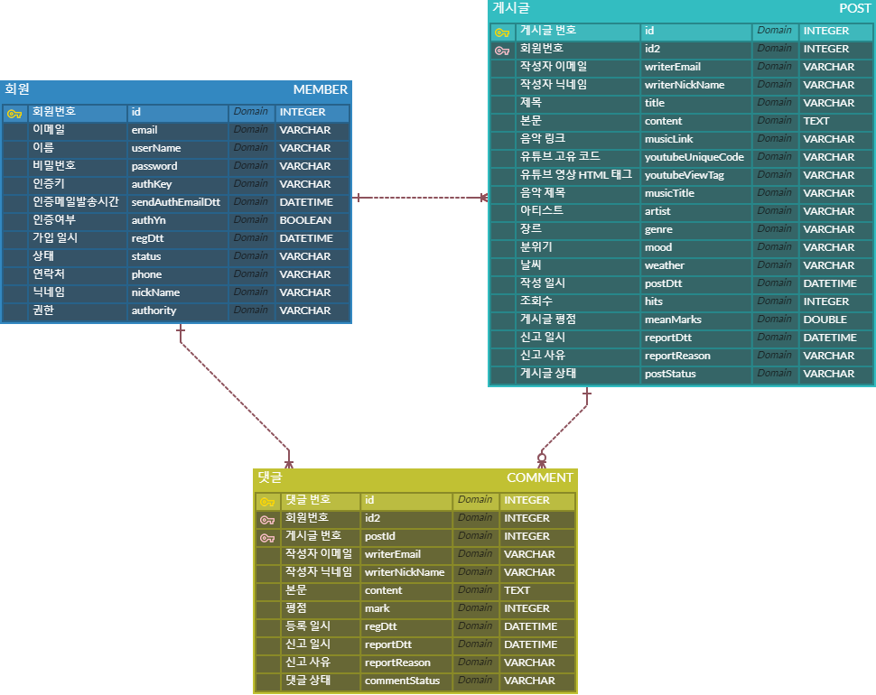

# Project: LiMu(Listen To This Music)_README.MD

## :hammer: *주제*

youtube music, melon 등 음악 스트리밍 서비스를 통해 사용자들이 편하게 음악 청취를 하고 있다.

음악 스트리밍 서비스를 통해 사용자들이 다양한 음악을 접하고 있지만, 자신이 좋아하는 음악을 추천해주거나 특정 음악에 대해 자유롭게 의견을 나누는 공간은 비교적 부족한 상황이다.

이와 같은 이유로 해당 프로젝트를 통해 사용자들이 서로 음악을 추천해주고, 의견을 나누면서 보다 풍성하게 음악 청취를 할 수 있는 서비스를 개발해보고자 한다.  

## :hammer: *사용 기술 스택*

  
  
  
   
  
  
   
  
  
  

 

## :hammer: *기능*

해당 서비스 기능 사용자는 크게 관리자와 일반 회원으로 구분된다.

관리자와 일반 회원이 공통 기능을 사용할 수 있으며, 관리자에게 추가 기능을 부여하고자 한다.

### 1. 관리자 기능

- **회원 관리 기능**
    - [x] 회원 목록 조회
    - [x] 회원 상세 정보 조회
    - [x] 회원 상태 수정 (가입 승인, 정지 등)
- **게시글 및 관리 기능**
    - [x] 타인(일반 회원)의 게시글 및 댓글 상태 변경(게시, 신고, 삭제)

### 2. 공통 기능

- **회원 가입 기능**
    - [x] 아이디(이메일)을 통한 중복 가입 방지
    - [x] 이메일을 통한 가입 인증
- **회원 탈퇴 기능**
    - [x] 회원 탈퇴 기능
- **회원 정보 수정 기능**
    - [x] 닉네임, 연락처 수정 가능
    - [x] 그 외 수정 불가능
- **게시글 기능**
    - [x] 게시글 등록, 삭제, 수정, 신고 기능
- **댓글 기능**
    - [x] 댓글 등록, 삭제, 수정, 신고 기능
- **검색 기능**
    - [x] 음악명, 아티스트명을 통한 검색 기능  

### 3. 추후 구현 예정 기능

- **필터링 검색**
    - [ ] 태그, 평점, 댓글 개수 등을 통한 필터링 검색
- **오늘 날씨에 어울리는 음악 추천**
  - [ ] 날씨 openAPI를 통해 오늘 날씨 데이터를 수집
  - [ ] 오늘 날씨에 어울리는 음악 추천 목록 제공
## :hammer: *DB 구조*  
